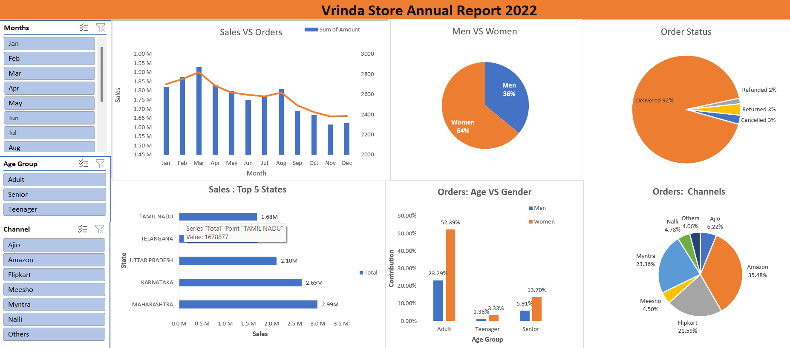

Vrinda Store Annual Report 2022 — Excel Dashboard

🔍 Project Overview

An interactive Excel dashboard built to analyze Vrinda Store’s 2022 performance using real customer order data. The dashboard highlights monthly sales trends, top-performing states, customer demographics, order fulfillment status, and channel-wise contribution — enabling clear business insights in one view.

🧠 Key Insights

• Women drove 64% of total orders, significantly higher than men.

• Delivered orders accounted for 92%, making order fulfillment highly efficient.

• Maharashtra, Karnataka, and Uttar Pradesh generated the highest sales.

• Amazon, Myntra, and Flipkart contributed the majority of the order volume.

• Adults (age group) were the largest buyers segment.

📊 Dashboard Components

• Sales vs Orders Trend (monthly)

• Pie charts for gender split, order status, and order channel distribution

• Top 5 states bar chart with total sales

• Age vs Gender contribution visualization

Interactive Slicers:

• Month

• Age group

• Sales channel

🧩 Excel Skills Demonstrated

• Power Query for data cleaning and combining datasets

• Pivot Tables & Pivot Charts

• Slicers & Timeline filters

• Dynamic dashboard layout

• Field calculations & formatting

• Data storytelling through visuals

🎯 Outcome

A clean, interactive Excel dashboard that presents a complete annual performance review of Vrinda Store and highlights key customer behavior, order channels, and sales distribution. Showcases practical data analysis and dashboard-building skills used in retail analytics.
